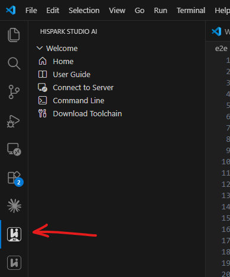

点击侧边栏HiSpark Studio AI的插件图标，点击Welcome下的Home进入主页面。

主页面:

点击图中Open，进入选择模型的页面。从History files中选择第一个模型，点击右边的Next按钮，进入后续量化 页面。

刚进入量化界面

打开validation 选项，出现Validation inputs.

Validation labels 选择非None，右边的文件选择框使能

一共有4种不同类型的运行量化操作的方式
1. 点击 Next Without Quantization，这会直接跳转到下一个界面（转换）
2. 不打开validation 选项，在Calibration Inputs中输入一个合理的路径，输入路径为文件夹。点击Quantize开始量化。
3. 打开validation 选项，在Calibration Inputs中和Validation Inputs中各输入一个合理的路径，输入路径为文件夹。点击Quantize开始量化
4. 在3的基础上，Validation labels选择非None，上传一个labels.csv，点击Quantize开始量化。

注意：
1. 只有第一种运行形式会直接自动跳转到后续页面，其他三种量化失败后会以message.window的形式告知错误，成功后会在下方的Quantization Result History中生成一条记录。点击量化结果的Next进入后续转换页面
2. 以上四种运行仅第4种，在Probability Density Histogram里会出现柱状图。
3. 所有的文件选择框都支持直接输入文本。

运行成功后结果如图所示

转换界面
直接点击Convert开始转换。无需上传或配置任何东西。

运行成功后如图：

