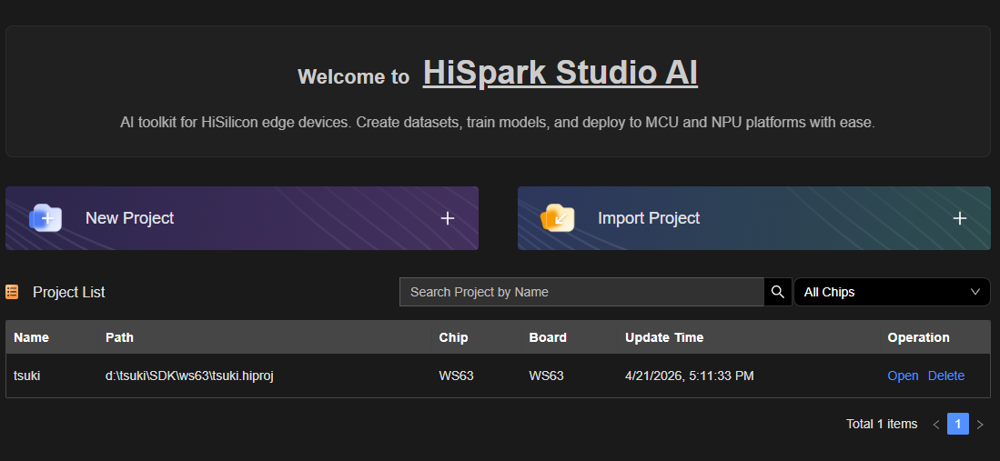
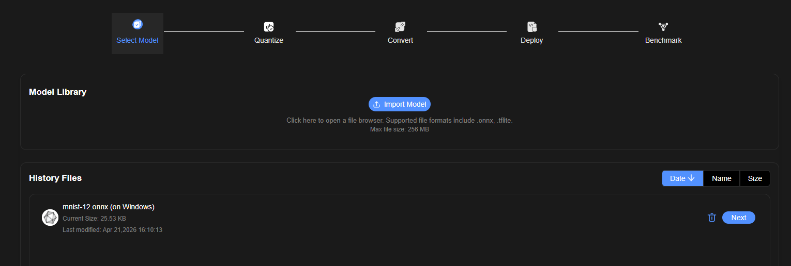
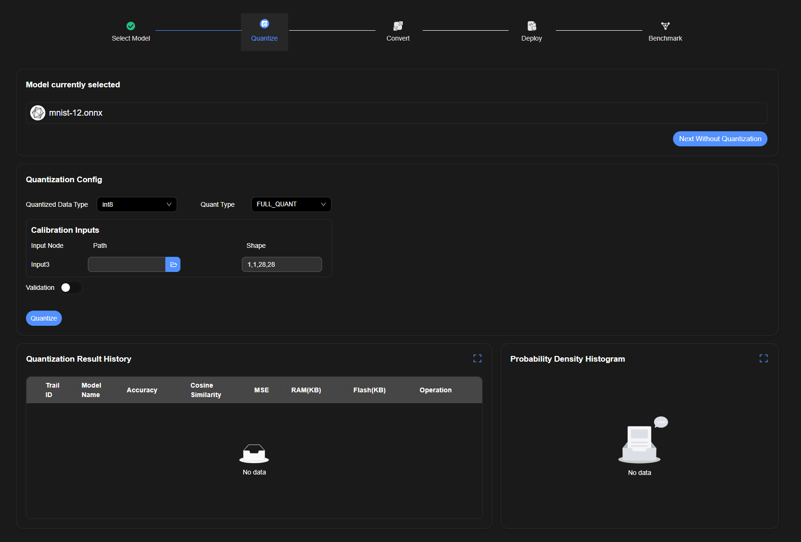
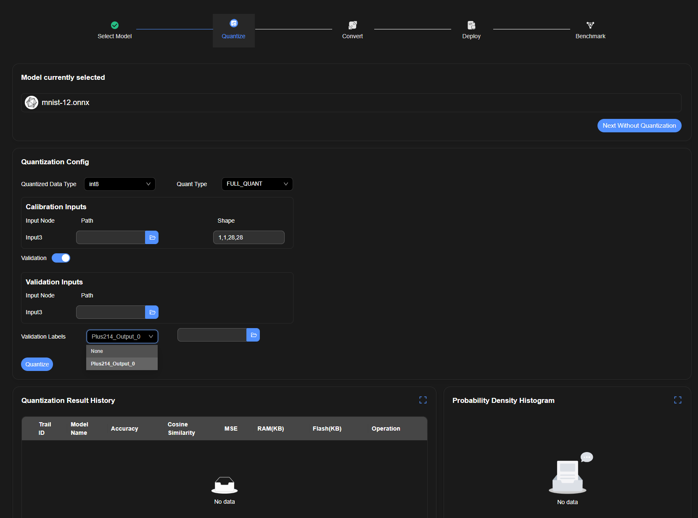

新建工程，从已有工程导入

选择模型，选择已有模型

刚进入量化界面

打开validation 选项，出现Validation inputs.

Validation labels 选择非None，右边的文件选择框使能

一共有4种不同类型的运行量化操作的方式
1. 点击 Next Without Quantization 直接跳转到下一个界面（转换）
2. 

运行成功后

Quantization History里会多一条目录，Probability Density Histogram里展示图像。

