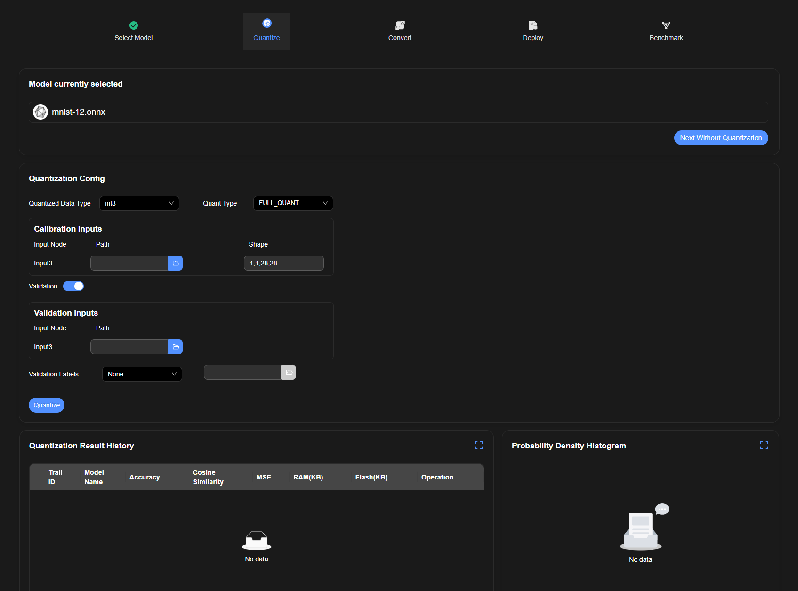
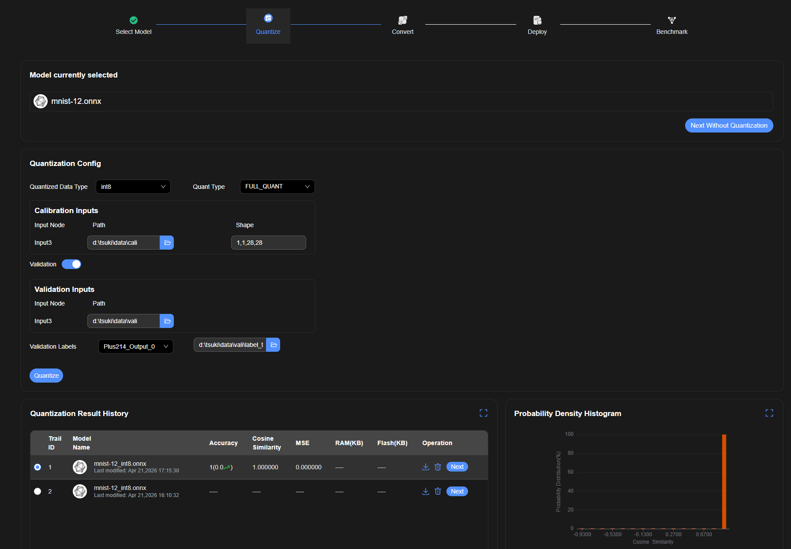

# Quantize — CPU PTQ ✅

Applies to: CPU SDK, all platforms (Windows / WSL / Linux share the same UI).

## Initial State

### Layout

- **Quantization Config** section:
  - "Quantized Data Type" dropdown (default: `int8`)
  - "Quant Type" dropdown (default: `FULL_QUANT`)
  - **Calibration Inputs** sub-section:
    - Table with columns: Input Node | Path | Shape
    - Each row: node name (e.g., `Input3`), path text input + folder-picker icon button, shape display (e.g., `1,1,28,28`)
  - **Validation** toggle (off by default)
- **Quantize** button (bottom of config)
- **"Next Without Quantization"** button (top right)
- **Quantization Result History** table (empty on first run, shows "No data")
- **Probability Density Histogram** (empty on first run, shows "No data")

## Validation Toggle — Expanded State

Turning on the Validation toggle reveals an additional **Validation Inputs** section below Calibration Inputs.

- **Validation Inputs** sub-section: same structure as Calibration Inputs (Input Node | Path)
- **Validation Labels** dropdown (default: `None`)
- File picker input next to Validation Labels (disabled when `None` is selected)

## Validation Labels Dropdown

When Validation Labels is set to a non-None value, the file picker input to the right becomes **enabled**.

- Dropdown options: `None`, and one or more output node names (e.g., `Plus214_Output_0`)
- Selecting a non-None option enables the file path input on the right

## 4 Execution Modes

### Mode 1 — Skip Quantization
- Click **"Next Without Quantization"**
- **Result:** Immediately navigates to Convert page, no history entry created

### Mode 2 — Calibration Only
- Leave Validation toggle **off**
- Fill Calibration Inputs path with a folder path (e.g., `data/mnist/cali/`)
- Click **Quantize**
- **Result:** Script runs; on success, a new row appears in Quantization Result History; page stays on Quantize
- **On failure:** A `vscode.window.showErrorMessage` notification appears

### Mode 3 — Calibration + Validation (no labels)
- Turn Validation toggle **on**
- Fill Calibration Inputs path (e.g., `data/mnist/cali/`)
- Fill Validation Inputs path (e.g., `data/mnist/vali/`)
- Leave Validation Labels as `None`
- Click **Quantize**
- **Result:** Same as Mode 2

### Mode 4 — Calibration + Validation + Labels
- Turn Validation toggle **on**
- Fill Calibration Inputs path (e.g., `data/mnist/cali/`)
- Fill Validation Inputs path (e.g., `data/mnist/vali/`)
- Set Validation Labels to a non-None option
- Fill the labels file path (e.g., `data/mnist/label.csv`)
- Click **Quantize**
- **Result:** Same as Mode 2, but the **Probability Density Histogram** is also populated with a bar chart

## Proceeding to Convert

After a successful quantization (Modes 2/3/4):
- A result row appears in Quantization Result History
- Click the **Next** button in that row's Operation column → navigates to Convert page

## Notes

- All path inputs accept direct text — use `fill()` in tests, do not interact with the folder-picker icon button
- Script execution time is variable; wait for the result row to appear (or error notification) rather than using a fixed timeout
- Mode 1 is the fast path for tests that just need to reach Convert without actual quantization
