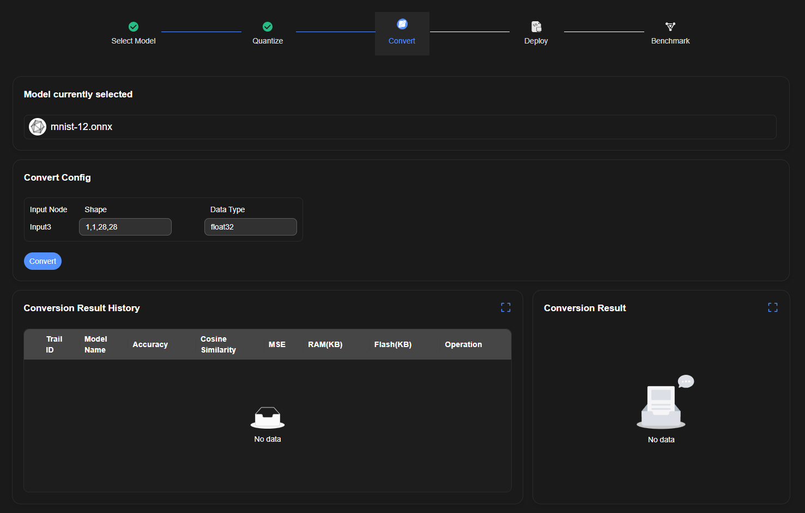
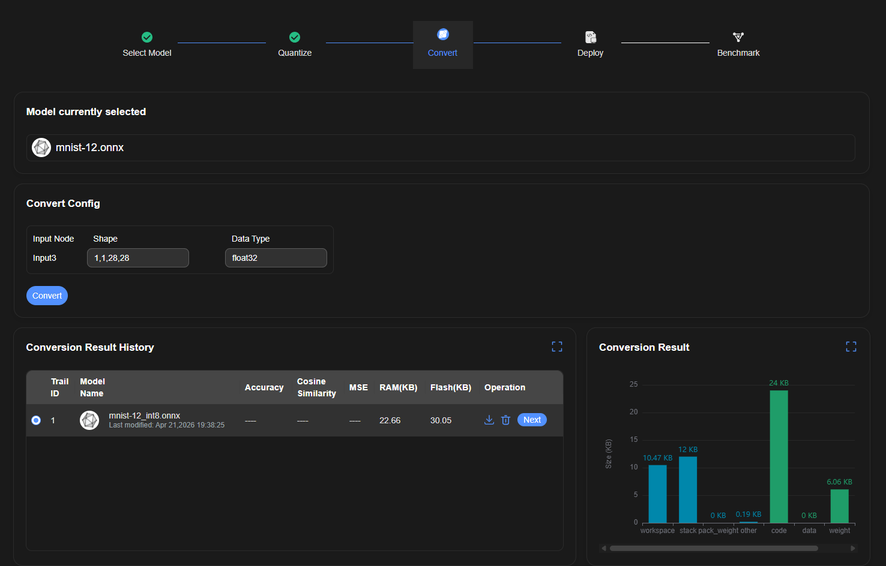

# Convert Page

## Variants

| SDK | Status |
|-----|--------|
| CPU | ✅ documented |
| NPU | ❌ not documented — has one additional input field vs CPU; stub only |

The CPU and NPU Convert pages share the same overall structure. The only known difference is that NPU has an extra input parameters field. The CPU flow below is the primary documented path.

---

## CPU — Initial State

### Layout

- **"Model currently selected"** — shows the model file carried through from previous steps
- **Convert Config** section:
  - Table: Input Node | Shape | Data Type (read-only display, pre-filled from model)
  - Example row: `Input3` | `1,1,28,28` | `float32`
- **Convert** button — starts conversion, no configuration needed
- **Conversion Result History** table (below config, empty on first run)
- **Conversion Result** panel (right side, shows bar chart after success, empty on first run)

## Execution

1. Click **Convert**
2. Script runs (no user input required)
3. On success: a new row appears in Conversion Result History, and the Conversion Result panel renders a bar chart

## Conversion Result — Success State

- Result row columns: Trail ID, Model Name, Accuracy, Cosine Similarity, MSE, RAM(KB), Flash(KB), Operation
- Operation column: download icon, delete icon, **Next** button
- **Conversion Result** panel: bar chart showing file size breakdown (workspace, stack, pack_weight, other, code, data, weight)
- Clicking **Next** in the result row navigates to Deploy

## NPU — ❌ NOT DOCUMENTED

> NPU has an additional input parameter field in the Convert Config section.
> Screenshots and detailed description needed before tests can be written for this variant.

## Notes

- No fields to fill — Convert is the simplest pipeline step
- Script execution time is variable; wait for the result row, do not use fixed timeouts
- Mode 1 of Quantize ("Next Without Quantization") also lands here — in that case, the model shown is the original (unquantized) model
